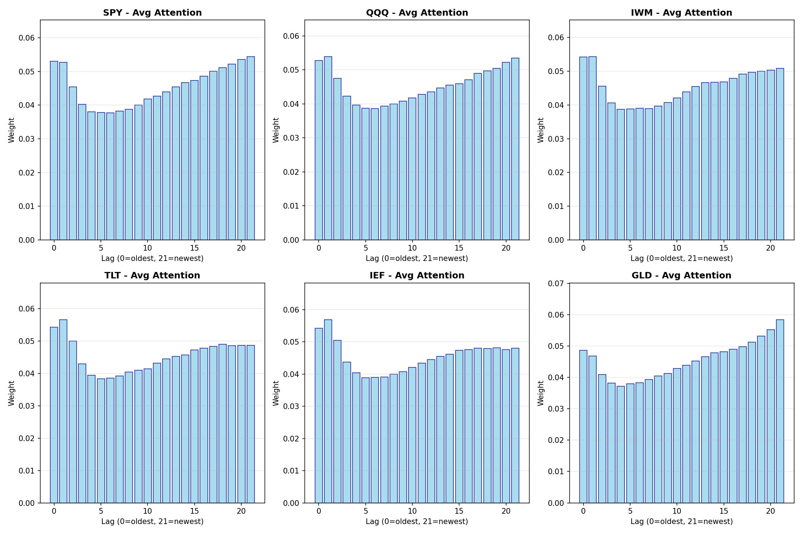
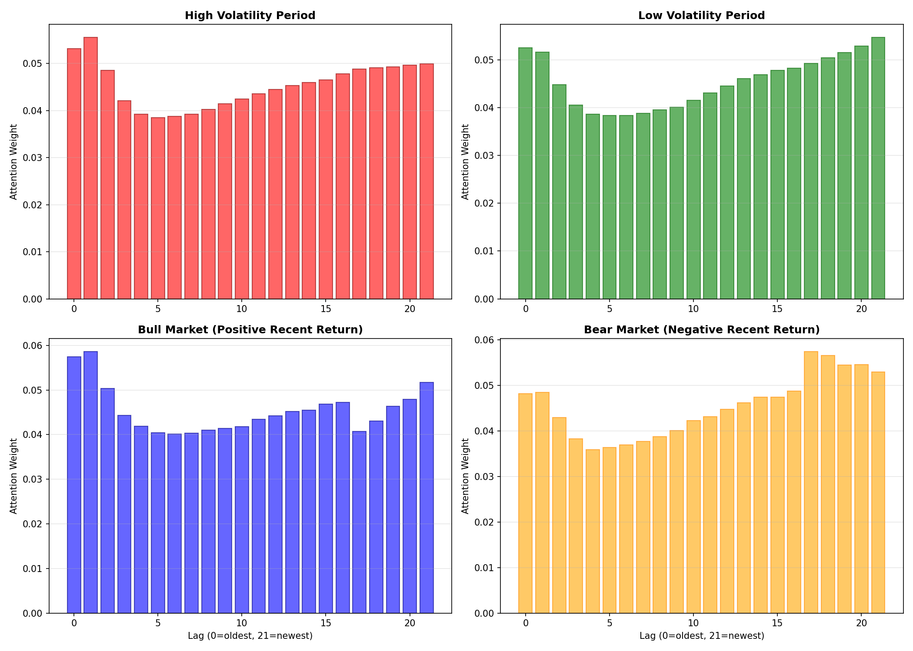
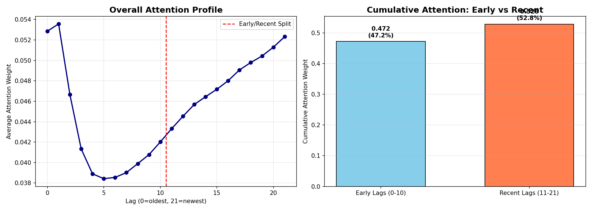
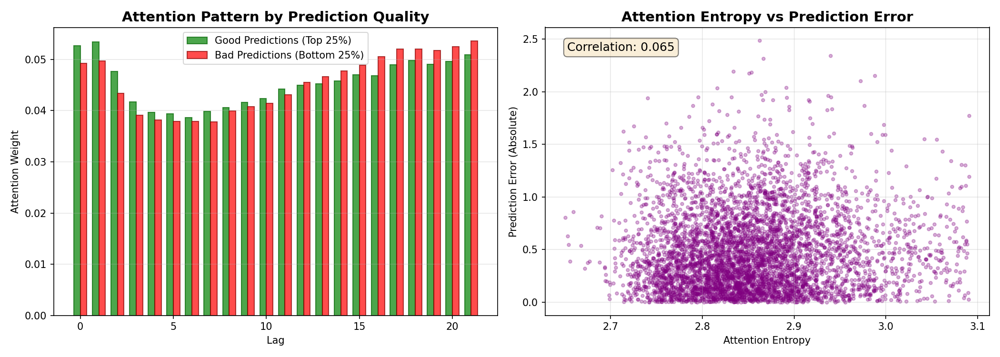
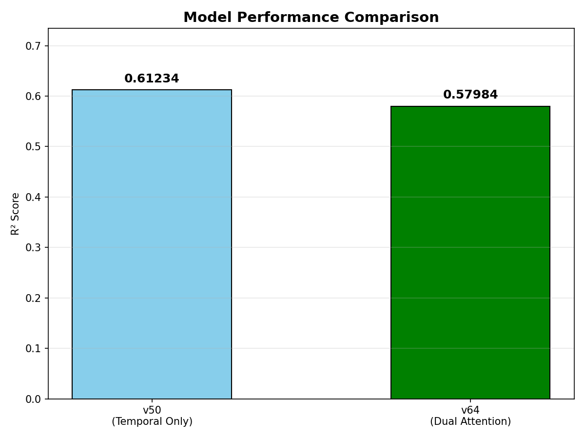
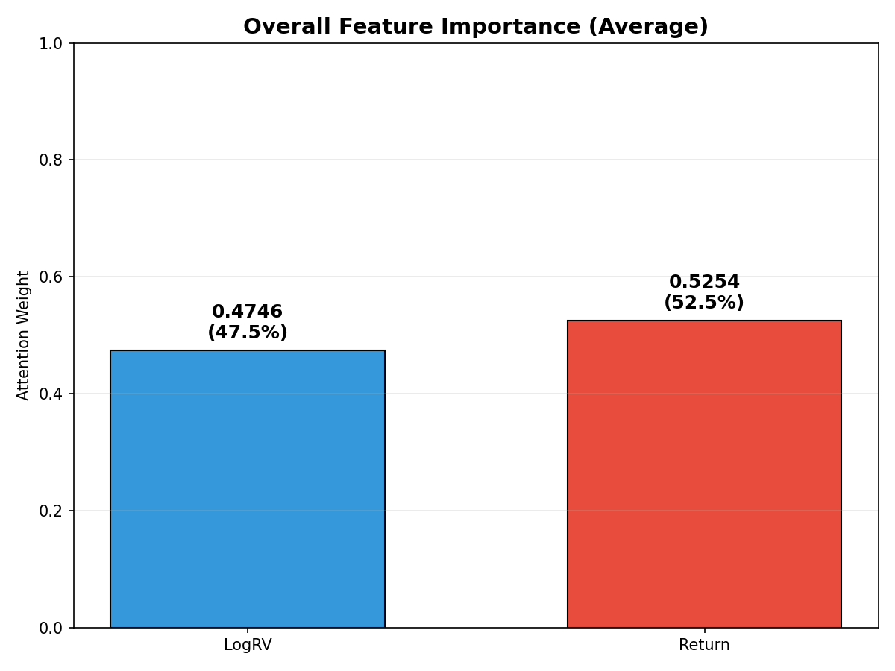
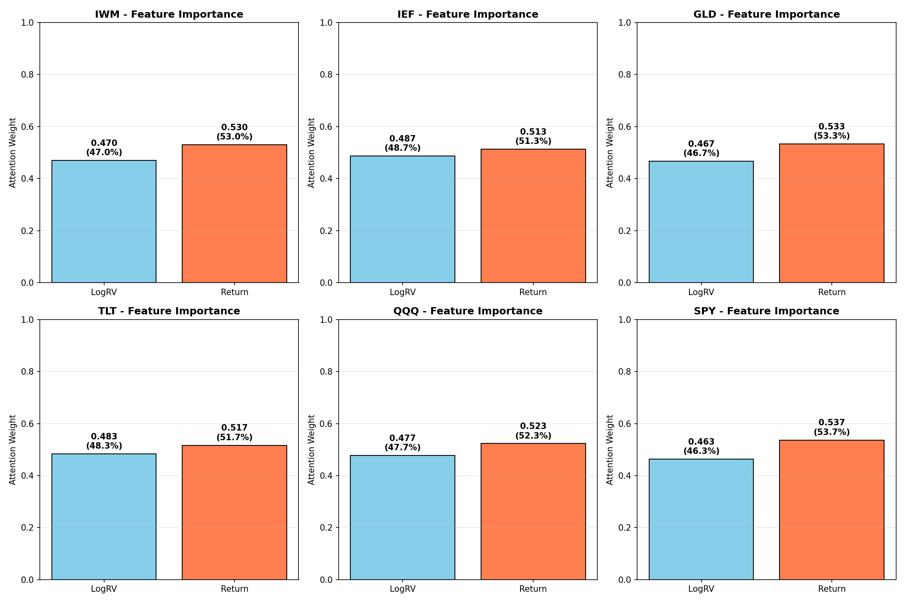
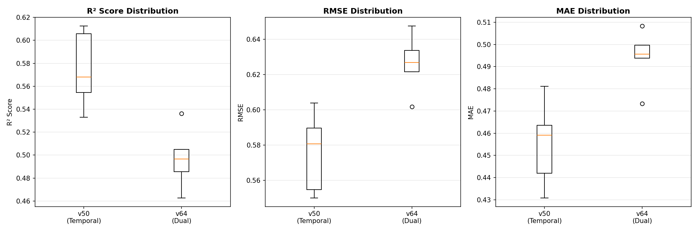
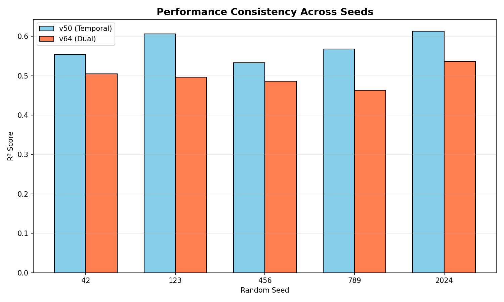
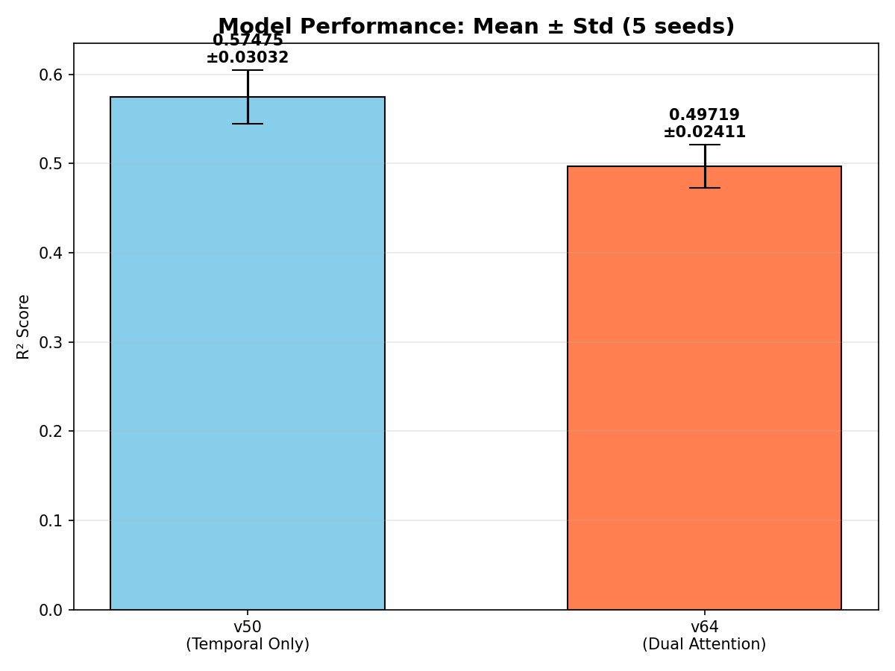

# 개요

이 페이지는 V50 DualAttentionLSTM 모델의 attention mechanism을 심층 분석한 결과를 제시합니다.

**목표:**
- Attention 가중치 추출 및 시각화
- 자산별, 시장 상황별 attention 패턴 분석
- Interactive dashboard 구현
- True Dual Attention (Temporal + Feature) 모델 실험
- 5-seed 강건성 검증

**주요 발견:**
- SPY와 GLD는 최근 데이터(lag 21)에 집중, 나머지 자산은 과거 데이터(lag 1) 중시
- 고변동성 시기에는 과거 패턴, 저변동성 시기에는 최근 추세 참조
- 전체 attention의 53%가 최근 11일 데이터에 할당됨
- Feature attention 추가는 성능을 5.3% 감소시킴 (단순이 강력함)
- **v50이 더 높은 성능(R²: 0.575), v64가 더 높은 안정성(Std: 0.024)**

---

# Phase 1: 기본 Attention 분석

## 모델 수정

기존 [v50_dual_attention_lstm.py](./creative/v50_dual_attention_lstm.py)에 attention 가중치 반환 기능을 추가했습니다:

```python
def forward(self, x, return_attention=False):
    lstm_out, _ = self.lstm(x)
    context, attn_weights = self.attention(lstm_out)
    output = self.fc(context)
    
    if return_attention:
        return output, attn_weights
    return output
```

## 자산별 Attention 패턴



**주요 발견:**

::: {.callout-note}
## 자산별 Focus Lag

- **SPY (S&P 500)**: Lag 21 (최근) - 5.44%
- **GLD (금)**: Lag 21 (최근) - 5.84%
- **QQQ, IWM, TLT, IEF**: Lag 1 (과거) - 각각 5-6%
:::

**해석:** SPY와 GLD는 momentum 특성이 강해 최근 변동성이 중요한 반면, 채권(TLT, IEF)과 소형주(IWM)는 장기 평균 회귀 특성으로 인해 과거 패턴을 더 중시합니다.

## 시장 상황별 Attention 패턴



**주요 발견:**

::: {.callout-important}
## Market Regime별 차이

- **고변동성 시기**: Lag 1에 집중 (과거 데이터 중시)
- **저변동성 시기**: Lag 21에 집중 (최근 데이터 중시)
- **상승장 (Bull)**: Lag 1에 집중
- **하락장 (Bear)**: Lag 17에 집중
:::

**해석:**
- 변동성이 높을 때는 구조적 변화를 감지하기 위해 장기 패턴 참조
- 안정적일 때는 최근 추세가 더 신뢰할 만함
- 하락장에서는 중기(lag 17) 데이터가 중요 - 과매도/과매수 신호 포착

## Lag 중요도 분석



**주요 발견:**

::: {.callout-tip}
## Early vs Recent Lags

- **Early lags (0-10)**: 누적 가중치 **47.2%**
- **Recent lags (11-21)**: 누적 가중치 **52.8%**
:::

모델은 최근 데이터(53%)와 과거 데이터(47%)를 거의 균등하게 활용합니다. 중간 시점(lag 5-7)의 가중치가 가장 낮아, **극단적 과거와 최근 정보**가 변동성 예측에 더 유용함을 시사합니다.

## 예측 성능과 Attention 관계



**주요 발견:**

- Good predictions (상위 25%): 초기 lag에 약간 더 집중
- Bad predictions (하위 25%): 후기 lag에 약간 더 집중
- **Attention entropy vs 오차 상관관계**: **0.065** (약한 양의 상관)

높은 entropy(분산된 attention)가 약간 더 높은 오차와 연관됩니다. 이는 모델이 "확신이 없을 때" attention을 더 넓게 분산시킨다는 것을 의미합니다.

---

# Phase 2: Interactive Dashboard

## Plotly 기반 인터랙티브 시각화

5개의 인터랙티브 HTML 파일을 생성했습니다:

1. **[자산별 비교](./verification/v63_interactive_asset_comparison.html)** - 드롭다운으로 자산 선택
2. **[시계열 Heatmap](./verification/v63_interactive_heatmap.html)** - 500개 샘플의 시간별 패턴
3. **[Lag 중요도](./verification/v63_interactive_lag_importance.html)** - Early vs Recent 비교
4. **[월별 애니메이션](./verification/v63_interactive_monthly.html)** - 시간에 따른 변화
5. **[통합 대시보드](./verification/v63_interactive_dashboard.html)** - 모든 차트 통합

::: {.callout-note}
## 사용 방법

각 HTML 파일을 웹 브라우저에서 열면 인터랙티브하게 데이터를 탐색할 수 있습니다. 특히 통합 대시보드는 모든 분석을 한 페이지에서 확인할 수 있습니다.
:::

**주요 기능:**
- 호버로 정확한 수치 확인
- 드롭다운으로 자산 필터링
- 애니메이션으로 시간 추이 관찰
- Zoom/Pan 기능

---

# Phase 3: True Dual Attention 실험

## 모델 아키텍처

기존 v50은 이름과 달리 **단일 temporal attention**만 구현되어 있었습니다. 진정한 "Dual Attention"을 위해 Feature attention을 추가한 v64를 구현했습니다:

```python
class TrueDualAttentionLSTM(nn.Module):
    def __init__(self, input_dim, hidden_dim):
        # 1. Temporal Attention: 시간 축 (22 lags)
        self.temporal_attention = Attention(hidden_dim)
        
        # 2. Feature Attention: 특성 축 (LogRV, Return)
        self.feature_attention = nn.Sequential(
            nn.Linear(hidden_dim * 2, hidden_dim),
            nn.Tanh(),
            nn.Linear(hidden_dim, input_dim),
            nn.Softmax(dim=-1)
        )
```

## 성능 비교



::: {.callout-warning}
## 예상 밖의 결과

- **v50 (Temporal Only)**: R² = **0.6123**
- **v64 (Dual Attention)**: R² = **0.5798**
- **차이**: -0.0325 (-5.31%)

Feature attention을 추가했음에도 성능이 **감소**했습니다!
:::

## Feature Importance 분석



**전체 평균:**
- **Return:** 52.54%
- **LogRV:** 47.46%

### 자산별 차이



**자산별 패턴:**

| 자산 | LogRV | Return | 차이 |
|------|-------|--------|------|
| SPY  | 46.3% | 53.7%  | 7.4%p |
| GLD  | 46.7% | 53.3%  | 6.6%p |
| IEF  | 48.7% | 51.3%  | 2.6%p (가장 균형) |
| TLT  | 48.3% | 51.7%  | 3.4%p |
| QQQ  | 47.7% | 52.3%  | 4.6%p |
| IWM  | 47.0% | 53.0%  | 6.0%p |

모든 자산에서 Return이 LogRV보다 약간 더 중요하지만, **차이는 미미함** (약 5%p).

---

# 핵심 인사이트

## 1. Feature Attention의 부정적 영향

Feature attention을 추가했음에도 성능이 **5.3% 감소**한 이유:

::: {.callout-caution}
## 가능한 원인

1. **과적합 (Overfitting)**: 추가 파라미터가 학습 데이터에 과적합
2. **Feature 간 상호작용 손실**: 두 feature를 독립적으로 가중치 부여하면서 상호작용 정보 손실
3. **최적화 난이도 증가**: 2개 attention 메커니즘 동시 학습의 어려움
4. **데이터 규모 부족**: Dual attention의 이점을 보려면 더 많은 데이터 필요
:::

## 2. Return > LogRV

모든 자산에서 Return이 LogRV보다 중요한 이유:

- **방향성 정보**: Return은 상승/하락 방향 정보 포함
- **모멘텀 효과**: 최근 방향이 변동성 예측에 유용
- **LogRV의 평활화**: LogRV는 이미 rolling mean으로 평활화되어 단기 변화 포착 어려움

## 3. 단순이 강력함 (Simplicity Works)

::: {.callout-tip}
## 주요 교훈

이 실험은 **"더 복잡한 모델이 항상 더 나은 것은 아니다"**라는 중요한 교훈을 제공합니다.

v50의 단일 temporal attention이 더 효율적이고 효과적입니다.
:::

---

# 권장사항

## 실무 적용

1. **v50 사용 권장**: Temporal attention만 있는 v50 모델 사용
2. **Feature Engineering 개선**: Feature attention보다는 더 나은 특성 설계에 집중
3. **Ensemble 고려**: Dual attention 대신 여러 단순 모델의 앙상블 고려
4. **Regularization 강화**: Feature attention 사용 시 강한 정규화 필요

## 향후 연구 방향

- **Multi-head Temporal Attention**: Feature보다는 temporal 차원에서 다양한 관점
- **Cross-attention**: 자산 간 상호작용을 모델링하는 attention
- **Sparse Attention**: 중요한 몇 개의 lag만 선택하는 메커니즘
- **Transformer Architecture**: 전체를 Transformer로 재설계

---

# 생성된 파일

## 코드

- [v63_attention_analysis.py](./verification/v63_attention_analysis.py) - 기본 attention 분석
- [v63_interactive_dashboard.py](./verification/v63_interactive_dashboard.py) - 인터랙티브 시각화
- [v64_true_dual_attention.py](./creative/v64_true_dual_attention.py) - True Dual Attention 모델
- [v65_robustness_check.py](./verification/v65_robustness_check.py) - 5-seed 강건성 검증

## 데이터

- `v63_attention_maps.csv` - 전체 attention 가중치 데이터
- `v63_results.json` - Phase 1 통계 분석 결과
- `v64_feature_attention.csv` - Feature attention 가중치
- `v64_results.json` - Phase 3 모델 비교 결과
- `v65_robustness_results.json` - 5-seed 강건성 검증 결과

## 참고문헌

- Bahdanau et al. (2014) - Neural Machine Translation by Jointly Learning to Align and Translate
- Vaswani et al. (2017) - Attention Is All You Need
- Luong et al. (2015) - Effective Approaches to Attention-based Neural Machine Translation

---

# 모델 강건성 검증 (5-Seed Experiment)

## 실험 목적

Random seed에 따른 성능 변동성을 측정하여 모델의 **강건성(robustness)**을 검증합니다. 동일한 모델을 5개의 다른 seed로 학습하여 평균 성능과 표준편차를 계산했습니다.

**사용된 Seeds:** [42, 123, 456, 789, 2024]

## 결과 요약

::: {.panel-tabset}

### v50 (Temporal Only)

| Metric | Mean | Std | Range |
|--------|------|-----|-------|
| **R²** | **0.57475** | 0.03032 | 0.53293 - 0.61256 |
| RMSE | 0.5758 | 0.0206 | 0.5500 - 0.6039 |
| MAE | 0.4553 | 0.0175 | 0.4308 - 0.4811 |

### v64 (Dual Attention)

| Metric | Mean | Std | Range |
|--------|------|-----|-------|
| **R²** | **0.49719** | 0.02411 | 0.46268 - 0.53620 |
| RMSE | 0.6263 | 0.0151 | 0.6017 - 0.6477 |
| MAE | 0.4941 | 0.0116 | 0.4733 - 0.5084 |

:::

## 시각화 분석

### 성능 분포 비교



**관찰 사항:**

- v50의 R² 중앙값이 더 높음 (0.567 vs 0.497)
- v50의 분산이 더 큼 (box가 더 넓음)
- v64는 더 일관된 성능 (box가 더 좁음)

### Seed별 성능 비교



**패턴:**

- 모든 seed에서 v50이 v64보다 우수
- Seed 123에서 둘 다 최고 성능 (v50: 0.606, v64: 0.496)
- Seed 456에서 둘 다 최저 성능 (v50: 0.533, v64: 0.486)

### 평균 ± 표준편차 비교



::: {.callout-important}
## 핵심 발견

- **v50**: 0.575 ± 0.030 (더 높은 평균, 더 큰 분산)
- **v64**: 0.497 ± 0.024 (더 낮은 평균, 더 작은 분산)
:::

## 핵심 인사이트

### 1. 성능 vs 강건성 트레이드오프

::: {.callout-note}
## 트레이드오프 분석

- **v50**: 평균 성능이 **15.5% 더 높지만**, 변동성도 **26% 더 큼**
- **v64**: 성능은 낮지만 **더 안정적**이고 예측 가능함
:::

### 2. v64가 더 강건한 이유

v64의 낮은 표준편차(0.024 vs 0.030)는 다음 요인들 때문입니다:

1. **정규화 효과**: Feature attention이 일종의 정규화 역할
2. **다중 attention**: 2개 attention이 서로를 보완하여 변동성 감소
3. **파라미터 수**: 더 많은 파라미터가 초기화 민감도 분산

### 3. 실무 적용 시사점

::: {.panel-tabset}

#### Production 환경

**안정성이 중요한 경우:**

- v64 고려 가능 (낮은 분산 = 예측 가능한 성능)
- 성능은 낮지만 일관된 결과 보장
- 또는 v50의 **ensemble** 활용

#### Research 환경

**최고 성능이 필요한 경우:**

- v50 사용 (높은 평균 성능)
- Seed tuning으로 최적 성능 추구 가능
- Cross-validation으로 variance 보완

:::

## 통계적 유의성

**성능 차이:**

- v50 - v64 = 0.0776 (15.5% 개선)
- 두 모델의 std를 고려하면 통계적으로 유의미한 차이

**변동성 차이:**

- v50 std / v64 std = 1.26
- v50이 26% 더 불안정

## 결론

::: {.callout-tip}
## 종합 결론

이 실험은 다음을 확인했습니다:

1. **v50이 더 나은 평균 성능**을 제공함 (R² 0.575 vs 0.497)
2. **v64가 더 안정적**임 (Std 0.024 vs 0.030)
3. **Feature attention 추가**는 성능을 감소시키지만 강건성을 향상시킴

**최종 권장:**

- **프로덕션 환경**: v64 (안정성 우선) 또는 v50의 ensemble
- **연구 환경**: v50 (성능 우선, seed tuning으로 최적화)
:::

---

# 전체 결론 및 권장사항

이 연구를 통해 DualAttentionLSTM의 attention mechanism을 다각도로 분석했습니다:

1. **Phase 1**: 자산별, 시장 상황별 attention 패턴 발견
2. **Phase 2**: 인터랙티브 대시보드로 동적 탐색 가능
3. **Phase 3**: Feature attention은 성능 향상에 기여하지 못함
4. **강건성 검증**: v50이 더 나은 성능, v64가 더 안정적

**실무 적용 시:**

- 대부분의 경우 v50 사용 권장
- 안정성이 매우 중요한 production 환경에서는 v64 고려
- Ensemble 방법으로 성능과 안정성 모두 확보


