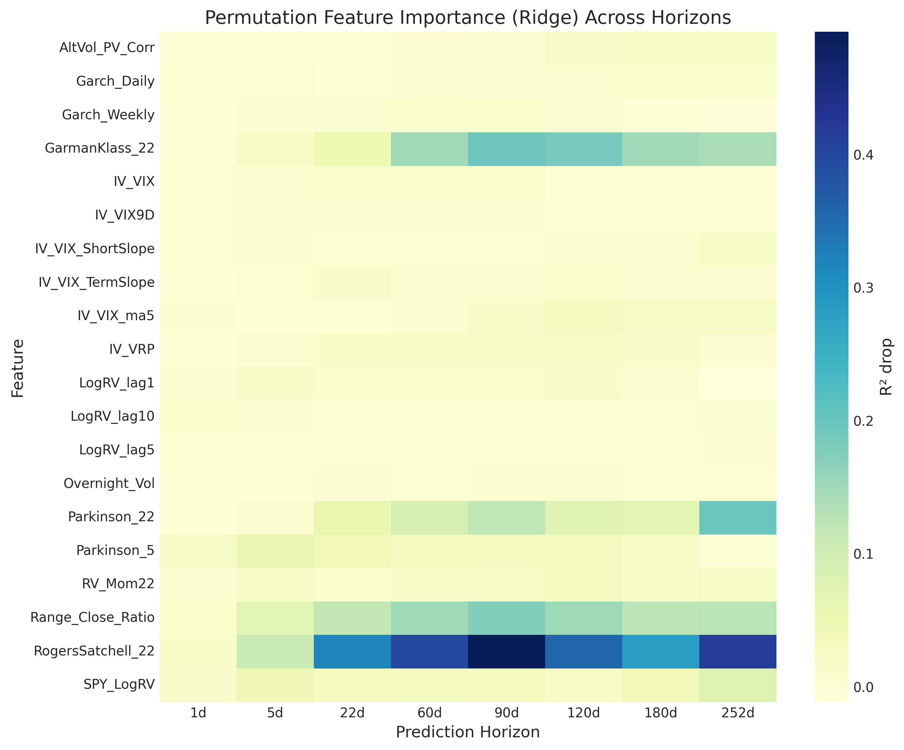
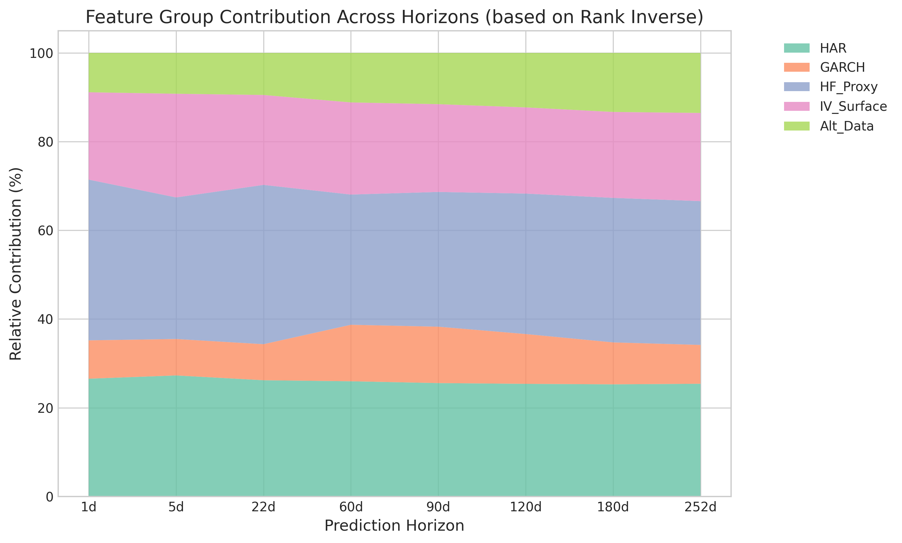
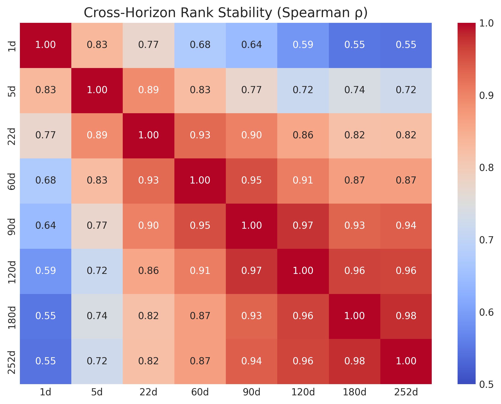

# 분석 개요

본 분석은 단일 모델이나 특정 지표에 편향되지 않은 **객관적 피처 기여도**를 산출하기 위해 설계되었습니다. 선형(Ridge), 트리(XGBoost, RF) 모델의 내재적 특성과 모델 불가지론적(Model-Agnostic) 평가 방법을 결합하여, 1일부터 252일까지의 예측 지표에서 피처의 역할 변화를 추적합니다.

::: {.callout-important}
## 핵심 연구 질문
**"예측 기간(Horizon)이 길어질수록 수익률 변동성을 결정하는 핵심 동력은 어떻게 변화하는가?"**
:::

---

## 1. 3-Layer 분석 프레임워크

통계적 엄밀성을 위해 다음과 같은 3층 구조로 기여도를 평가했습니다.

1.  **Layer 1 (Model-Specific):** Ridge 계수, XGBoost Gain, RF MDI 등 모델 고유의 중요도 산출.
2.  **Layer 2 (Model-Agnostic):** Permutation Importance(Block-shuffle 적용), Mutual Information, Spearman 상관계수 등을 통해 모델 구조와 무관한 기여도 평가.
3.  **Layer 3 (Consensus Aggregation):** 위 지표들을 통합하여 합의 순위(Mean Rank)와 **부트스트랩 신뢰구간(95% CI)** 산출.

---

## 2. 예측 지표별 합의 순위 (Top-10)

지평이 변함에 따라 상위권 피처의 구성이 유의미하게 달라지는 것을 확인할 수 있습니다.

::: {.panel-tabset}

### 1d (Short-term)
단기 지평에서는 **HF Proxy(OHLC)** 계열이 압도적입니다. 특히 `Parkinson_5`와 `RogersSatchell_22`가 최상위를 차지하며 실시간 가격 변동폭의 중요도를 증명합니다.

### 22d (Medium-term)
1개월 지평에서는 `RogersSatchell_22`와 `GarmanKlass_22`가 여전히 강세이나, 주간 GARCH(`Garch_Weekly`) 성분이 상위권으로 진입하며 변동성 지속성(Persistence)의 역할이 커집니다.

### 252d (Long-term)
1년 지평에서는 일중 변동성 지표의 영향력이 약해지고, **GARCH 성분과 SPY 시장 변동성(`SPY_LogRV`)**이 주축이 됩니다. 또한 `Alt_Vol` 계열의 기여도가 상승하며 구조적 요인이 부각됩니다.

:::

---

## 3. 시각화 분석

### O1: 지평별 PFI 히트맵
모든 모델에서 공통적으로 관찰되는 피처별 R² 감소량(PFI) 추이입니다. 단기에서 장기로 갈수록 특정 피처에 집중되었던 중요도가 여러 피처로 분산되는 경향을 보입니다.

### O3: 카테고리별 상대적 기여도
피처 그룹(HAR, HF Proxy, IV, Alt)이 전체 예측력에서 차지하는 비중의 변화입니다. 

*   **HF Proxy (그린):** 단기에서 지배적이나 장기로 갈수록 비중 축소.
*   **GARCH (회색/기타):** 장기 지평으로 갈수록 비중이 확대되며 변동성 군집 현상을 설명.

### O5: 지평 간 순위 안정성 (Spearman ρ)
지평 쌍 간의 피처 순위 유사도를 측정했습니다. 

인접한 지평(예: 90d-120d, $\rho=0.97$) 간에는 매우 높은 유사도를 보이지만, **1d와 252d 사이의 상관계수는 0.55**까지 하락합니다. 이는 단기 예측 모델이 장기 예측에서 그대로 사용될 수 없음을 시사하는 구조적 전환의 증거입니다.

---

## 4. 통계적 합의도: Kendall's W

7가지 서로 다른 방법론(Ridge, XGB, RF, PFI, MI 등)이 피처 순위에 대해 얼마나 일치된 의견을 보이는지 검정했습니다.

| Horizon | Kendall's W | p-value | 합의 강도 |
|:---|:---:|:---:|:---|
| 1d | 0.441 | < 0.001 | 유의적 |
| 22d | 0.589 | < 0.001 | 강함 |
| 60d | 0.480 | < 0.001 | 유의적 |
| 252d | 0.470 | < 0.001 | 유의적 |

*22일(1개월) 지평에서 방법론 간의 합의가 가장 강하게 나타났으며, 이는 해당 지평의 예측 신호가 가장 명확함을 의미합니다.*

---

## 5. 결론 및 인사이트

1.  **동적 중요도:** 피처 중요도는 고정된 값이 아니며, 예측 지평에 따라 구조적으로 변화합니다.
2.  **HF Proxy의 우월성:** 1개월 이내의 예측에서는 고빈도 데이터 대용치인 OHLC 기반 추정량이 HAR 성분보다 강력한 예측력을 가집니다.
3.  **장기 예측의 전향:** 6개월 이상의 장기 예측에서는 시장 전체의 전이 효과(Cross-Asset)와 저빈도 통계 모델(GARCH)의 역할이 핵심적입니다.
